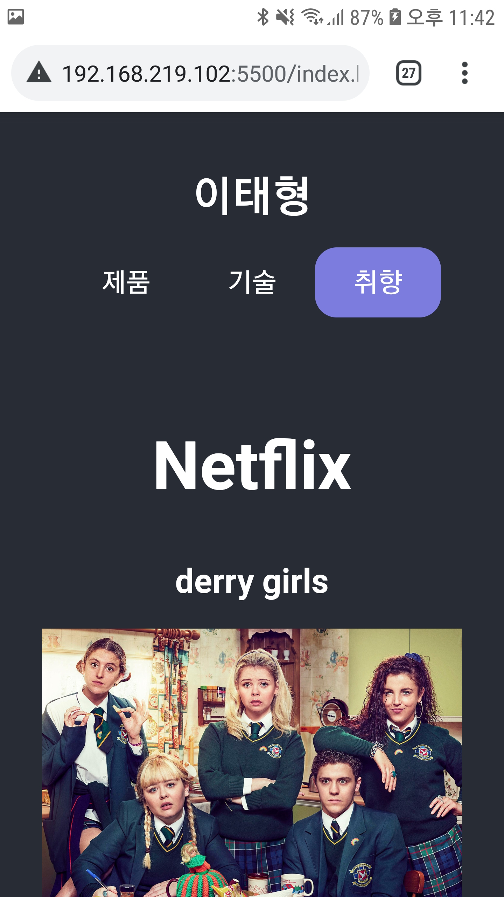
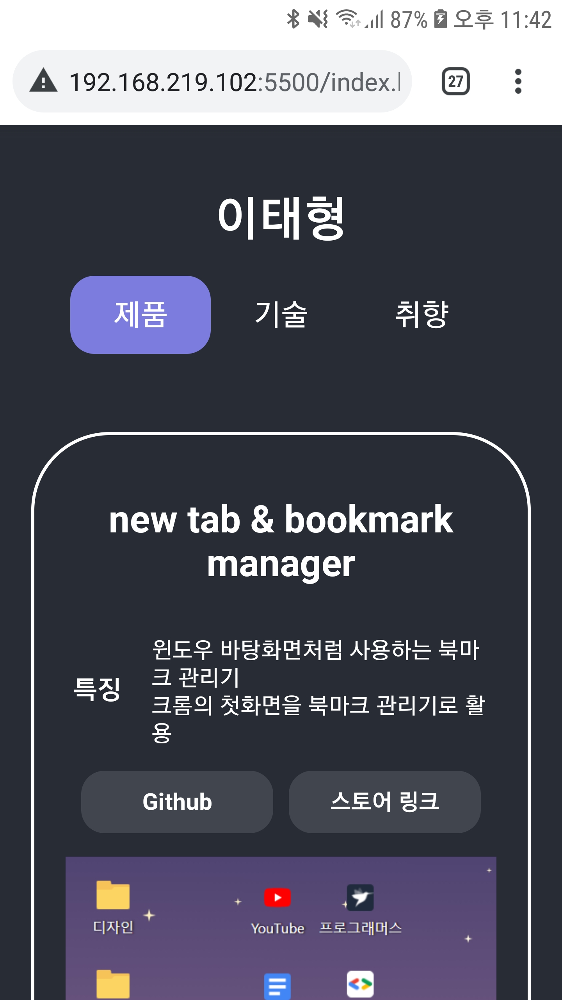
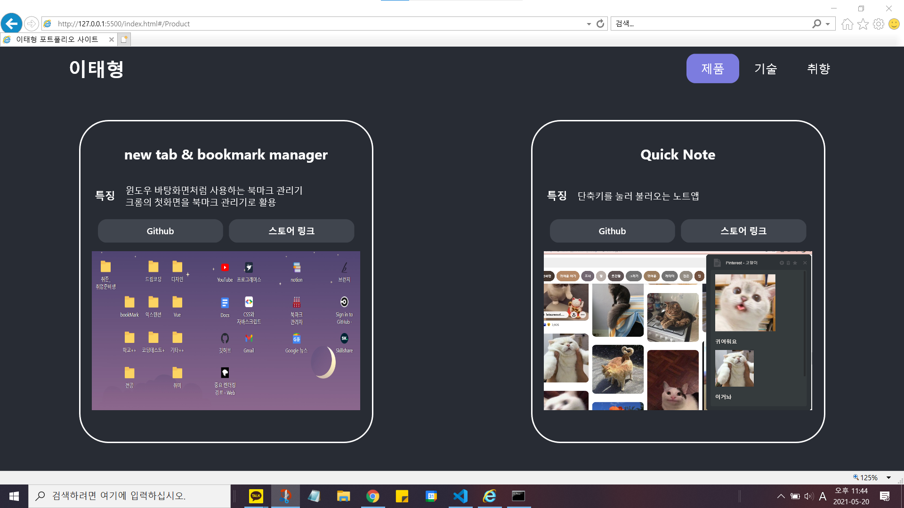

# 자기소개~~

https://momongss.github.io/

## 사용기술

- React
- webpack, babel

## 특징

- flex box 와 media query 로 반응형 디자인을 했어요.
  - 모바일 화면에서도 잘 보여요.

---

---

 

- babel 을 사용해서 크로스브라우징 이슈를 해결했어요.
  - IE 11 에서 99% 잘 동작하는 걸 확인했어요.

---

